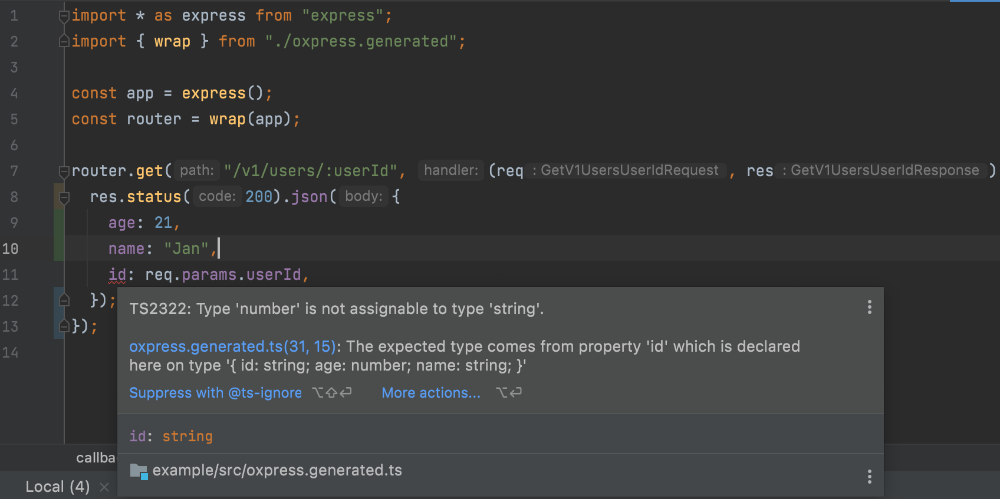

# What is oxpress?

Do you like **TypeScript, Express and OpenAPI** and use those tools for **API development**?

Then oxpress is made for you. Oxpress is a code generation tool,
which generates a **type-safe Express server** based on your OpenAPI Document.

### Design First Approach

Unlike other tools like [tsoa](https://github.com/lukeautry/tsoa),
oxpress fully embraces the [design first](https://swagger.io/blog/api-design/design-first-or-code-first-api-development/)
kind of API development.

To sum this up: The design first approach puts the OpenAPI Document first, and your server just becomes an implementation of your specification.

### Type Safety

OpenAPI makes you able to describe your API in great detail. Why not have this amount of detail within your Express-Application?
The following parts of Express are fully typed by oxpress:

* Routes
* Route Parameters
* Query Parameters
* Request Body (JSON)
* Response Body (JSON), in conjunction with the Status Code

### Integrated Validation

Oxpress uses `express-openapi-validator` by default to validate parameters. This ensures,
that your beautifully typed parameters and responses are also type safe during runtime.
